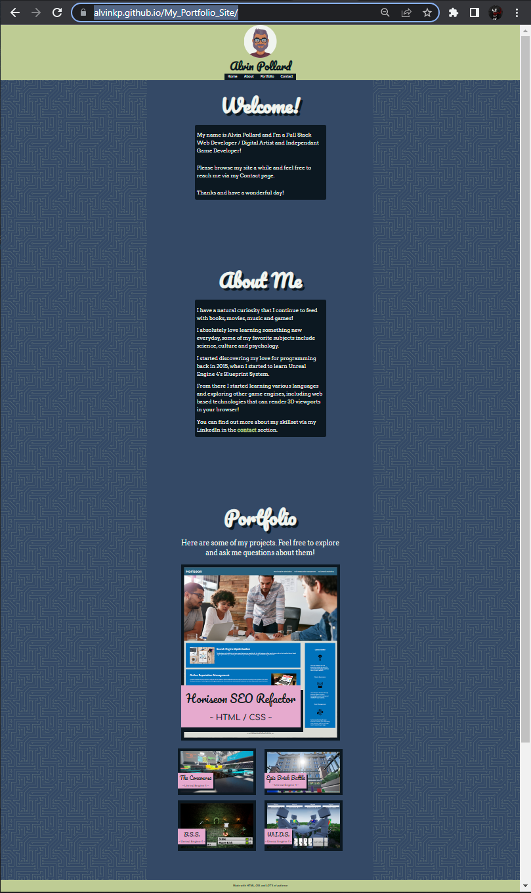
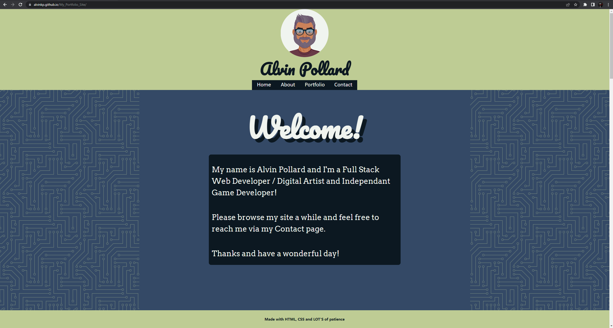
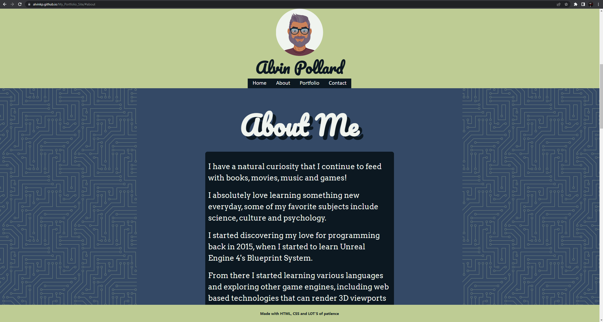
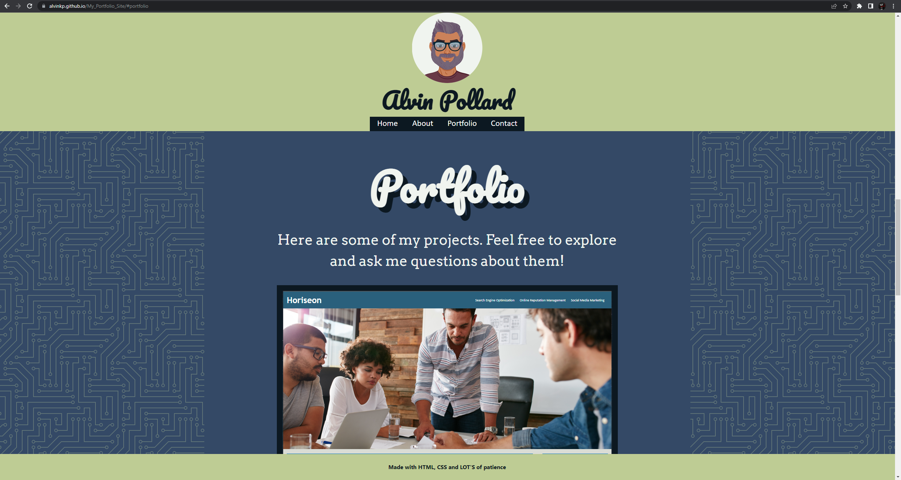
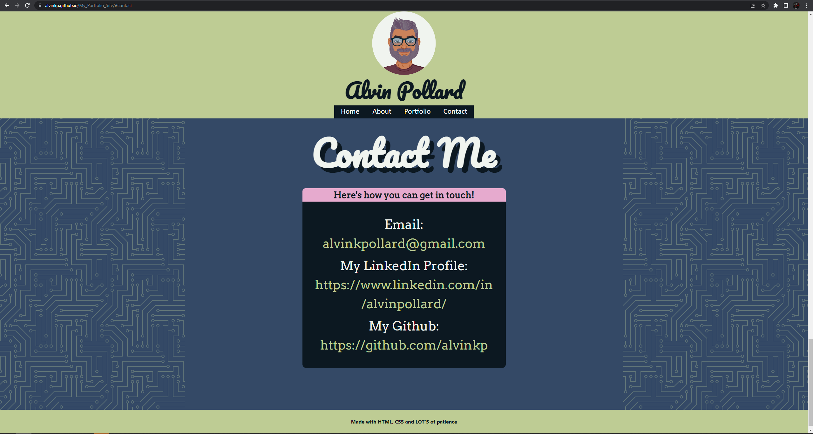

# My Portfolio Site

This was the second challenge assignment for our UPENN Bootcamp. We were tasked with creating a Portfolio Website from scratch for a potential employer. (See **User Story** and **Acceptable Criteria** sections below).

---

## 📕 User Story 

AS AN employer
I WANT to view a potential employee's deployed portfolio of work samples
SO THAT I can review samples of their work and assess whether they're a good candidate for an open position

---

## ✔️ Acceptable Criteria 

- GIVEN I need to sample a potential employee's previous work WHEN I load their portfolio THEN I am presented with the developer's name, a recent photo or avatar, and links to sections about them, their work, and how to contact them

- WHEN I click one of the links in the navigation THEN the UI scrolls to the corresponding section

- WHEN I click on the link to the section about their work
THEN the UI scrolls to a section with titled images of the developer's applications

- WHEN I am presented with the developer's first application THEN that application's image should be larger in size than the others

- WHEN I click on the images of the applications THEN I am taken to that deployed application

- WHEN I resize the page or view the site on various screens and devices
THEN I am presented with a responsive layout that adapts to my viewport

---

## 🔧 Optimizations 

### HTML
- Created HTML and CSS to satisfy the needs of the client.
- Ensured that the site showed up properly on multiple devices with different viewport sizes and orientations.
- Added descriptive alt text to relevant images for screen readers to function properly.
- Established a <main> section to highlight the most important information.
- Ensured heading attributes are in sequential order.
- Removed extra and unused classes and ids

### CSS
- Condensed redundant styling.
- Removed extra and unused selectors.

### Additional
- Commented both the HTML and CSS so future edits will be easier to execute.
- Enabled smooth scrolling for a polished experience.

---

## 📷 Screenshots 

---

## 🎯 Deployment

Website: https://alvinkp.github.io/My_Portfolio_Site/

Repository: https://github.com/alvinkp/My_Portfolio_Site

---

## ✉️ Authors 

- [@alvinkp](https://www.github.com/alvinkp)

